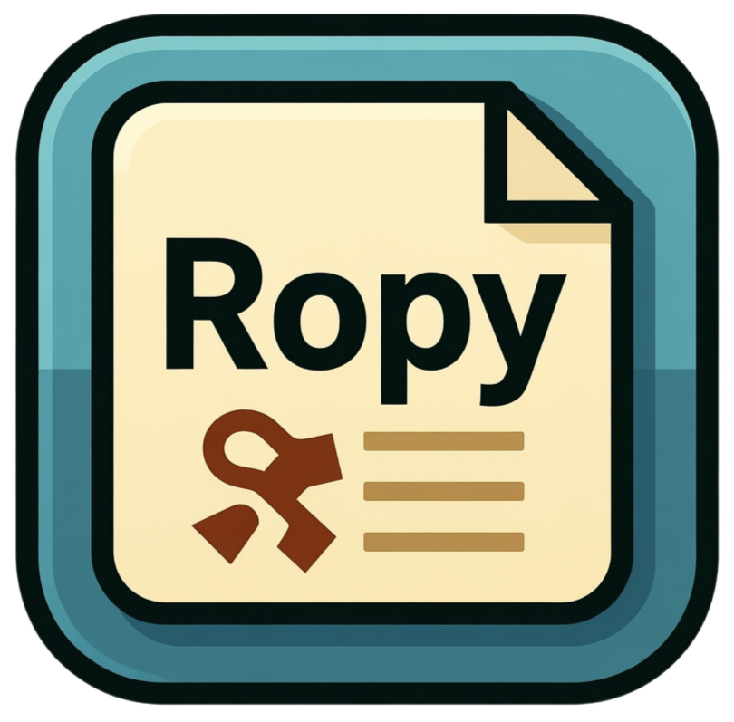
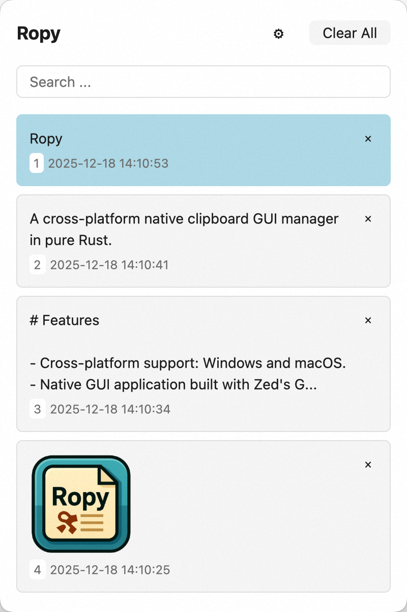

<p align="center"></p>

<h2 align="center"><em><strong>R</strong>opy <strong>O</strong>rganizes <strong>P</strong>revious <strong>Y</strong>anks</em></h2>

<p align="center">
<a href="https://github.com/studentweis/ropy/blob/main/LICENSE"></a>
<a href="https://github.com/studentweis/ropy/releases"></a>
<a href="https://rust-lang.org"></a>
</br>
<a href="https://github.com/studentweis/ropy"></a>
<a href="https://github.com/studentweis/ropy/issues"></a>
</p>

<p align="center">A cross-platform native clipboard GUI manager in pure Rust.</p>

<p align="center">


</p>

# Features

- Cross-platform support: Windows and macOS.
- Native GUI application built with Zed's GPUI.
- Lightweight and fast.
- Easy-to-use interface for managing clipboard history.
- Search functionality to quickly find previous clipboard entries.
- Auto start on system boot.
- Keyboard shortcuts for quick access.

# Installation

## Pre-built Binaries

You can download the latest pre-built binaries from the [Releases](https://github.com/StudentWeis/ropy/releases) page.

## Building from Source

Make sure you have Rust installed. You can install Rust using [rustup](https://rustup.rs/).

1. Clone the repository:

```bash
git clone https://github.com/StudentWeis/ropy.git
cd ropy
```

2. Build the project:

```bash
cargo build --release
```

3. Run the application:

```bash
./target/release/ropy
```

# Usage

- Launch the application, and it will start monitoring your clipboard.
- Use the global hotkey(Ctrl/Control + Shift + D) of tray icon to access the clipboard history.
- Click on any entry or use 1/2/3/4/5 to select an entry using keyboard to copy it back to the clipboard.
- Use the search bar to filter clipboard entries.

# Acknowledgements

- Inspired by other clipboard managers like Ditto, Maccy & CopyQ.
- Thanks to the Rust community for their support and libraries.
- System Clipboard API: [clipboard-rs](https://github.com/ChurchTao/clipboard-rs)
- GUI Library: [Zed's gpui](https://github.com/zed-industries/zed/tree/main/crates/gpui)
- GUI Components: [gpui-component](https://github.com/longbridge/gpui-component)
- Global Hotkey: [global-hotkey](https://github.com/tauri-apps/global-hotkey)
- Tray Icon: [tray-icon](https://github.com/tauri-apps/tray-icon)
- Database: [sled](https://github.com/spacejam/sled)
- Configuration Management: [config-rs](https://github.com/rust-cli/config-rs)
