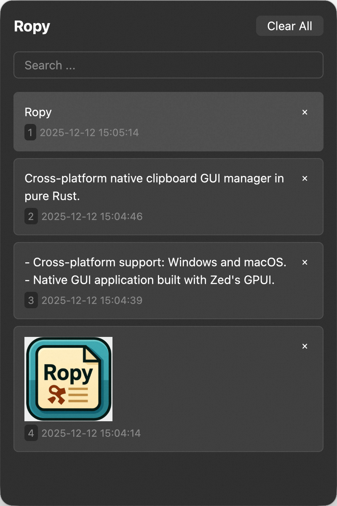

A cross-platform native clipboard GUI manager in pure Rust.

# Features

- Cross-platform support: Windows and macOS.
- Native GUI application built with Zed's GPUI.

# TODO

- Theme Toogle
- Support for multiple languages
- Log files
- Provide installation packages and distribution channels
- Support customizable shortcuts
- Support clipboard content categorization
- Provide detailed user documentation
- Support more platforms (Linux)

Windows Bug：

- 微信聊天框闪退
- ShareX 会自动拷贝两份
- 窗口无法拖动。

# NOT TODO

- 不支持获取拷贝时的应用来源（系统剪切板不提供该字段，需要 Hack 获取）。
- 不支持插件扩展功能（目前没有计划支持插件机制，Ropy 旨在保持轻量和简单）。
- 不支持在线同步剪切板内容（目前不考虑云同步功能）。
- 不支持命令行操作（Ropy 主要面向 GUI 用户，不提供命令行界面）。
