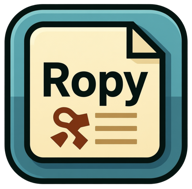

<p align="center"></p>

<h2 align="center"><em><strong>R</strong>opy <strong>O</strong>rganizes <strong>P</strong>revious <strong>Y</strong>anks</em></h2>

<p align="center">
<a href="https://github.com/studentweis/ropy/blob/main/LICENSE"></a>
<a href="https://github.com/studentweis/ropy/releases"></a>
<a href="https://rust-lang.org"></a>
<br>
<a href="https://github.com/studentweis/ropy"></a>
<a href="https://github.com/studentweis/ropy/issues"></a>
</p>

<p align="center">Cross-platform, lightweight clipboard manager written in Rust and GPUI.</p>

<p align="center">English | <a href="doc/README/README_ZH.md">简体中文</a></p>

<p align="center">

</p>

## Features

- Native desktop application built with Zed's GPUI.
- Cross-platform support for Windows, macOS, and Linux (X11).
- Tracks text, rich text (HTML/RTF), image, and file path clipboard history with content-based deduplication.
- Switchable list and grid layout modes for browsing history.
- Search the loaded history with case-sensitive and whole-word options.
- Favorite and pin records; automatic cleanup preserves pinned and favorited items.
- Preview text and images with a configurable hover delay.
- Configurable global hotkey, theme, language, autostart, and confirm mode.
- System tray integration plus in-app update check, download, and install flow.

## Installation

### Pre-built Binaries

Download the latest binaries from the [Releases](https://github.com/StudentWeis/ropy/releases) page.

### macOS

After downloading the `.dmg` file and dragging Ropy.app to the Applications folder, you may need to remove the quarantine attribute to run the application without issues. Open Terminal and run the following commands:

```sh
xattr -rc /Applications/Ropy.app
sudo xattr -r -d com.apple.quarantine /Applications/Ropy.app
```

### Windows

You can install Ropy using [Scoop](https://scoop.sh/):

```sh
scoop bucket add extras
scoop install ropy
```

> [!NOTE]
> If you install Ropy via Scoop, it is recommended to disable Ropy's built-in auto-update feature to avoid conflicts with Scoop's package management. You can disable auto-updates in Ropy's settings.

### Build from source

Ensure you have Rust installed (via `rustup`). Then:

```bash
git clone https://github.com/StudentWeis/ropy.git
cd ropy
cargo build --release
./target/release/ropy
```

## Usage

- Launch Ropy to start recording clipboard history.
- Use the global hotkey or the tray icon to open the history window.
- Press `/` to focus search, then refine results with case-sensitive, whole-word, and type filters.
- Use `Up`/`Down` or `J`/`K` to move through items, and `Enter` or `1`-`5` to confirm a selection.
- Press `Shift+Enter` to paste as plain text when a rich-text record is selected.
- In grid mode, use `H`/`L` to move between columns.
- Press `Space` to toggle preview, `F` to favorite the selected record, and `Delete` or `D` to remove it.
- Use row actions to pin records so they are excluded from storage cleanup.
- Choose between `copy_to_clipboard` and `paste_immediately` confirm modes in Settings.

## Limitations (Not planned)

- The system clipboard does not expose the original application source for copied items.
- Plugin/extension system: no current plans — Ropy focuses on simplicity and small footprint.
- Cloud sync: not supported at this time.
- Command-line mode: Ropy is designed primarily as a GUI application.

## Acknowledgements

- Inspired by clipboard managers such as Ditto, Maccy and CopyQ.
- Thanks to the Rust community and all upstream projects used by Ropy.
- System Clipboard API: [clipboard-rs](https://github.com/ChurchTao/clipboard-rs)
- GUI library: [Zed's gpui](https://github.com/zed-industries/zed/tree/main/crates/gpui)
- GUI components: [gpui-component](https://github.com/longbridge/gpui-component)
- Global hotkey: [global-hotkey](https://github.com/tauri-apps/global-hotkey)
- Tray icon helper: [tray-icon](https://github.com/tauri-apps/tray-icon)
- Embedded DB: [redb](https://github.com/cberner/redb)
- Configuration: [config-rs](https://github.com/rust-cli/config-rs)

## Star History

<a href="https://www.star-history.com/?repos=studentweis%2Fropy&type=date&legend=top-left">
 <picture>
   <source media="(prefers-color-scheme: dark)" srcset="https://api.star-history.com/chart?repos=studentweis/ropy&type=date&theme=dark&legend=top-left" />
   <source media="(prefers-color-scheme: light)" srcset="https://api.star-history.com/chart?repos=studentweis/ropy&type=date&legend=top-left" />
   
 </picture>
</a>
