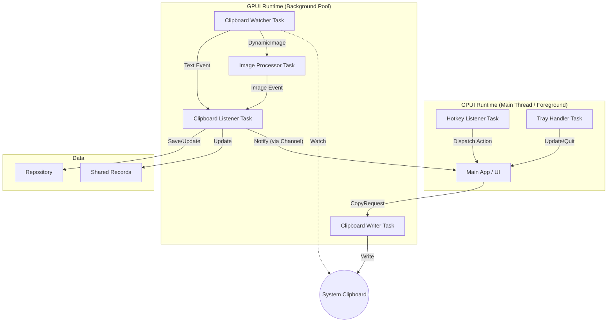
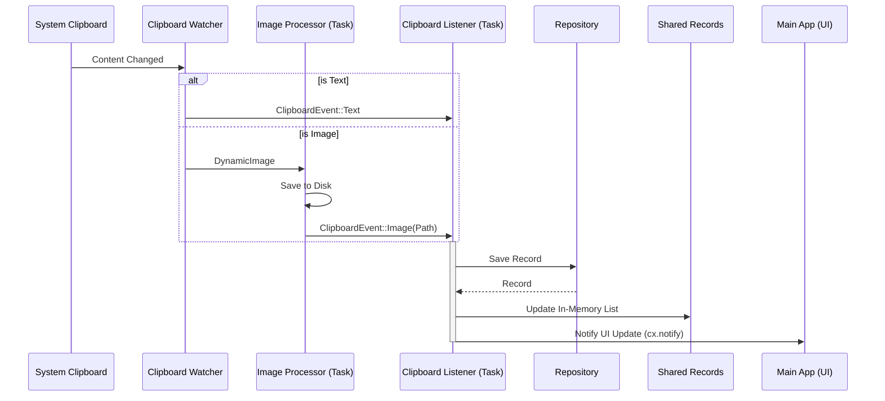

**Concurrency Analysis**

This document details the threading model and message passing architecture of the Ropy application.

# Thread Model

The application primarily uses GPUI's async executors for event handling and background processing, minimizing the use of dedicated OS threads.

| Entity                 | Executor   | Responsibility                                    |
| :--------------------- | :--------- | :------------------------------------------------ |
| **Main App**           | Foreground | Runs the GPUI event loop, handles UI rendering.   |
| **Hotkey Listener**    | Foreground | Polls global hotkey events.                       |
| **Tray Handler**       | Foreground | Polls system tray menu events.                    |
| **Clipboard Watcher**  | Background | Runs `clipboard-rs` watcher (blocking operation). |
| **Image Processor**    | Background | Processes and saves images from clipboard.        |
| **Clipboard Listener** | Background | Receives clipboard events and updates repository. |
| **Clipboard Writer**   | Background | Handles requests to write to system clipboard.    |

> **Note**: Most "background" operations are implemented as async tasks running on the GPUI Background Executor (a thread pool), rather than spawning new OS threads for each component.

# Message Passing

The application relies on channels (`async_channel`) for communication between tasks.

## 1. Clipboard Monitoring Flow

- **Source**: `Clipboard Watcher` task detects a change.
- **Path 1 (Text)**: Sends `ClipboardEvent::Text` via `clipboard_tx` (async_channel) to the **Clipboard Listener Task**.
- **Path 2 (Image)**:
  1. Sends `DynamicImage` via `image_tx` (async_channel) to the **Image Processor Task**.
  2. **Image Processor Task** saves the image and sends `ClipboardEvent::Image` via `clipboard_tx` to the **Clipboard Listener Task**.
- **Handling**: The **Clipboard Listener Task** receives `ClipboardEvent`, updates the `Repository`, and updates the `SharedRecords`.
- **UI Notification**: After updating the records, the **Clipboard Listener Task** sends a signal through a notification channel to a foreground task, which then calls `cx.notify()` on the `WindowHandle` to refresh the UI.

## 2. Hotkey Flow

- **Source**: `GlobalHotKeyEvent` receiver.
- **Mechanism**: A task on the **Foreground Executor** (Main Thread) polls the receiver.
- **Handling**: When a hotkey is detected, the task directly dispatches an `Active` action to the window via `async_app.update`.

## 3. Tray Flow

- **Source**: `TrayIcon` menu events.
- **Path**: `tray_icon::menu::MenuEvent::receiver()`.
- **Mechanism**: A task on the **Foreground Executor** (Main Thread) polls the receiver.
- **Handling**: The **Tray Handler Task** either shows the window or quits the app based on the event ID.

## 4. Copy/Paste Flow

- **Source**: User interaction in **Main App** (UI).
- **Path**: Sends `CopyRequest` via `copy_tx` (async_channel) to the **Clipboard Writer Task**.
- **Handling**: **Clipboard Writer Task** writes the content to the system clipboard.

# Architecture Diagram

# Detailed Data Flow

## Clipboard Event Processing

