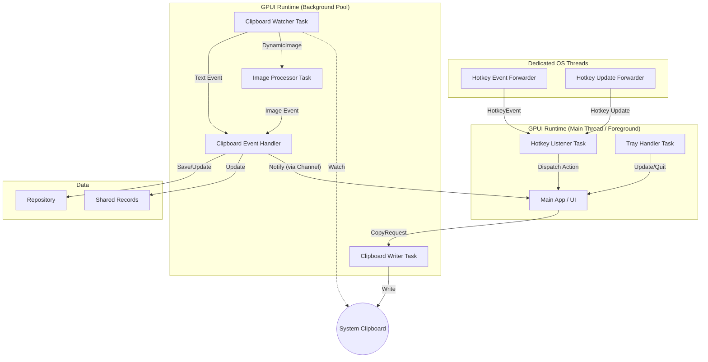
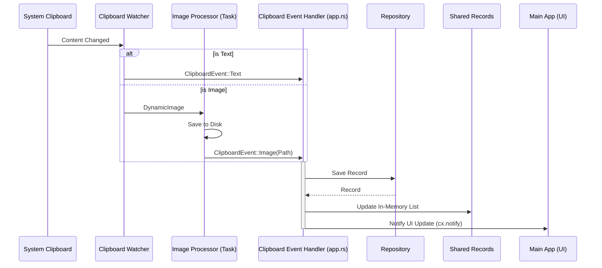

**Concurrency Analysis**

This document details the threading model and message passing architecture of the Ropy application.

# Thread Model

The application primarily uses GPUI's async runtime (`cx.spawn()` / `cx.background_spawn()`) for event handling and background processing. It also uses a small number of dedicated OS threads where external APIs expose blocking receivers or blocking work is simpler to isolate. All subsystems are initialized directly from the `App` context (`&mut App`), avoiding manual executor extraction.

| Entity                      | Executor   | Responsibility                                    | Module              |
| :-------------------------- | :--------- | :------------------------------------------------ | :------------------ |
| **Main App**                | Foreground | Runs the GPUI event loop, handles UI rendering.   | `gui`               |
| **Hotkey Listener**         | Foreground | Receives bridged hotkey messages and updates UI. | `gui::hotkey`       |
| **Hotkey Event Forwarder**  | OS Thread  | Blocks on `GlobalHotKeyEvent::receiver()`.       | `gui::hotkey`       |
| **Hotkey Update Forwarder** | OS Thread  | Blocks on hotkey update channel messages.        | `gui::hotkey`       |
| **Tray Handler**            | Foreground | Consumes forwarded tray actions and updates UI.   | `gui::tray`         |
| **Tray Event Forwarders**   | OS Thread  | Blocks on tray/menu receivers and bridges events. | `gui::tray`         |
| **Clipboard Watcher**       | Background | Runs `clipboard-rs` watcher (blocking operation). | `clipboard`         |
| **Image Processor**         | Background | Processes and saves images from clipboard.        | `clipboard`         |
| **Clipboard Event Handler** | Background | Receives clipboard events and updates repository. | `app`               |
| **Clipboard Writer**        | Background | Handles requests to write to system clipboard.    | `clipboard`         |

> **Note**: Most "background" operations are implemented as async tasks spawned via `cx.background_spawn()` (running on a GPUI thread pool). A few components still use dedicated OS threads when an integration provides a blocking API, such as the hotkey bridge and updater download/check flows. Foreground tasks use `cx.spawn()`, which provides an `AsyncApp` handle for UI updates.
>
> The top-level `app` module (`src/app.rs`) is responsible for orchestrating all subsystems: it initializes the clipboard monitor, repository, GUI window, hotkey listener, and tray handler, and wires them together via async channels. All subsystem startup functions receive `&mut App` directly, using `cx.spawn()` and `cx.background_spawn()` instead of manually extracting executors. The `gui` module focuses solely on rendering and window management.

# Message Passing

The application relies on channels (`async_channel`) for communication between tasks.

## 1. Clipboard Monitoring Flow

- **Source**: `Clipboard Watcher` task detects a change.
- **Path 1 (Text)**: Sends `ClipboardEvent::Text` via `clipboard_tx` (async_channel) to the **Clipboard Listener Task**.
- **Path 2 (Image)**:
  1. Sends `DynamicImage` via `image_tx` (async_channel) to the **Image Processor Task**.
  2. **Image Processor Task** saves the image and sends `ClipboardEvent::Image` via `clipboard_tx` to the **Clipboard Listener Task**.
- **Handling**: The **Clipboard Event Handler** (defined in `app.rs`) receives `ClipboardEvent`, updates the `Repository`, and updates the `SharedRecords`.
- **UI Notification**: After updating the records, the **Clipboard Event Handler** sends a signal through a notification channel to a foreground task, which then calls `cx.notify()` on the `WindowHandle` to refresh the UI.

## 2. Hotkey Flow

- **Source**: `GlobalHotKeyEvent` receiver.
- **Path**:
  1. `Hotkey Event Forwarder` blocks on `GlobalHotKeyEvent::receiver()` and forwards events into an `async_channel`.
  2. `Hotkey Update Forwarder` blocks on hotkey setting updates and forwards them into the same `async_channel`.
- **Mechanism**: A foreground task spawned via `cx.spawn()` awaits the unified message stream. The `AsyncApp` handle is provided as a closure parameter.
- **Handling**: Update messages re-register the current hotkey. Pressed hotkey events dispatch an `Active` action to the window via `async_app.update`.

## 3. Tray Flow

- **Source**: `TrayIcon` menu events and tray click events.
- **Path**:
  1. Dedicated forwarder threads block on `tray_icon::menu::MenuEvent::receiver()` and `TrayIconEvent::receiver()`.
  2. Supported events are converted into internal tray actions and sent through an `async_channel`.
- **Mechanism**: A foreground task spawned via `cx.spawn()` awaits the unified tray action stream. The `AsyncApp` handle is provided as a closure parameter.
- **Handling**: The **Tray Handler Task** either shows the window or quits the app via `async_app.update`.

## 4. Copy/Paste Flow

- **Source**: User interaction in **Main App** (UI).
- **Path**: Sends `CopyRequest` via `copy_tx` (async_channel) to the **Clipboard Writer Task**.
- **Handling**: **Clipboard Writer Task** writes the content to the system clipboard.

# Architecture Diagram

# Detailed Data Flow

## Clipboard Event Processing

