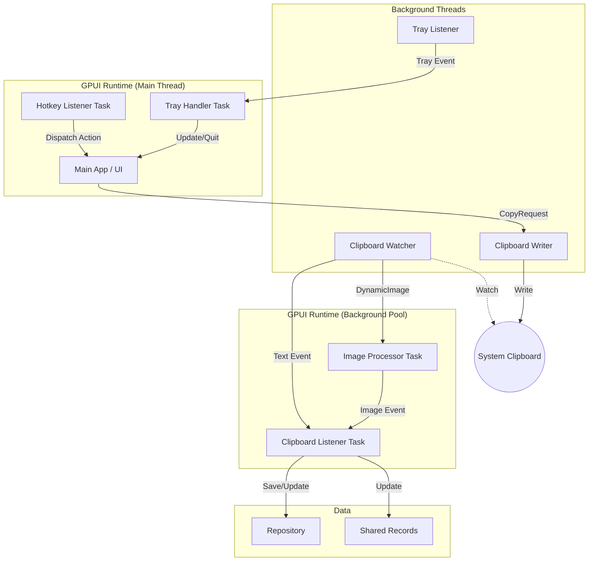
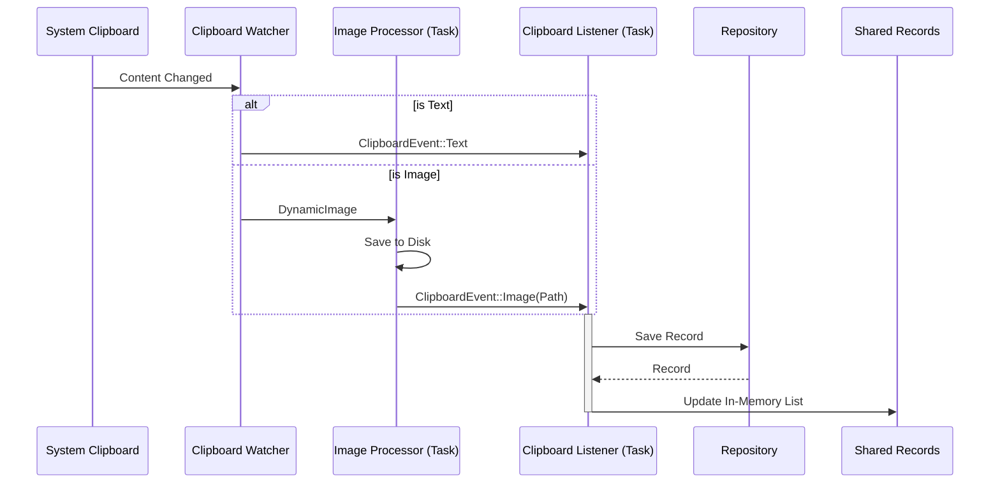

**Concurrency Analysis**

This document details the threading model and message passing architecture of the Ropy application.

# Thread Model

The application uses a hybrid architecture combining dedicated OS threads for blocking operations and GPUI's async executors for event handling and background processing.

| Thread | Responsibility | Spawned By |
| :--- | :--- | :--- |
| **Main Thread** | Runs the GPUI event loop, handles UI rendering, processes events, and runs the Hotkey Listener task. | OS / `main` |
| **Clipboard Watcher** | Uses `clipboard-rs` to monitor system clipboard changes. | `clipboard::start_clipboard_monitor` |
| **Clipboard Writer** | Handles requests to write text or images back to the system clipboard. | `clipboard::start_clipboard_writer` |
| **Tray Listener** | Listens for system tray menu events (Show, Quit). | `tray::init_tray` |
| **GPUI Background** | A thread pool managed by GPUI for running async tasks (Image Processing, Clipboard Event Handling). | GPUI Runtime |
| **RSS Monitor** | (Debug only) Monitors RSS usage. | `monitor::spawn_rss_monitor` |

> **Note**: The "Image Processor" and "Hotkey Listener" are implemented as async tasks running on the GPUI executors rather than dedicated OS threads.

# Message Passing

The application relies on channels (`std::sync::mpsc` and `async_channel`) for communication between threads and async tasks.

## 1. Clipboard Monitoring Flow

- **Source**: `Clipboard Watcher` thread detects a change.
- **Path 1 (Text)**: Sends `ClipboardEvent::Text` via `clipboard_tx` (async_channel) to the **Clipboard Listener Task**.
- **Path 2 (Image)**:
  1. Sends `DynamicImage` via `image_tx` (async_channel) to the **Image Processor Task** (running on GPUI Background executor).
  2. **Image Processor Task** saves the image and sends `ClipboardEvent::Image` via `clipboard_tx` to the **Clipboard Listener Task**.
- **Handling**: The **Clipboard Listener Task** (running on GPUI Background executor) receives `ClipboardEvent`, updates the `Repository`, and updates the `SharedRecords`.

## 2. Hotkey Flow

- **Source**: `GlobalHotKeyEvent` receiver.
- **Mechanism**: A task on the **Main Thread** (Foreground Executor) polls the receiver.
- **Handling**: When a hotkey is detected, the task directly dispatches an `Active` action to the window via `async_app.update`.

## 3. Tray Flow

- **Source**: `Tray Listener` thread detects menu click.
- **Path**: Sends `TrayEvent` via `tray_tx` (mpsc) to the **Tray Handler Task**.
- **Handling**: The **Tray Handler Task** (running on Main Thread / Foreground Executor) polls `tray_rx` and either shows the window or quits the app.

## 4. Copy/Paste Flow

- **Source**: User interaction in **Main App** (UI).
- **Path**: Sends `CopyRequest` via `copy_tx` (mpsc) to the `Clipboard Writer` thread.
- **Handling**: `Clipboard Writer` writes the content to the system clipboard.

# Architecture Diagram

# Detailed Data Flow

## Clipboard Event Processing

