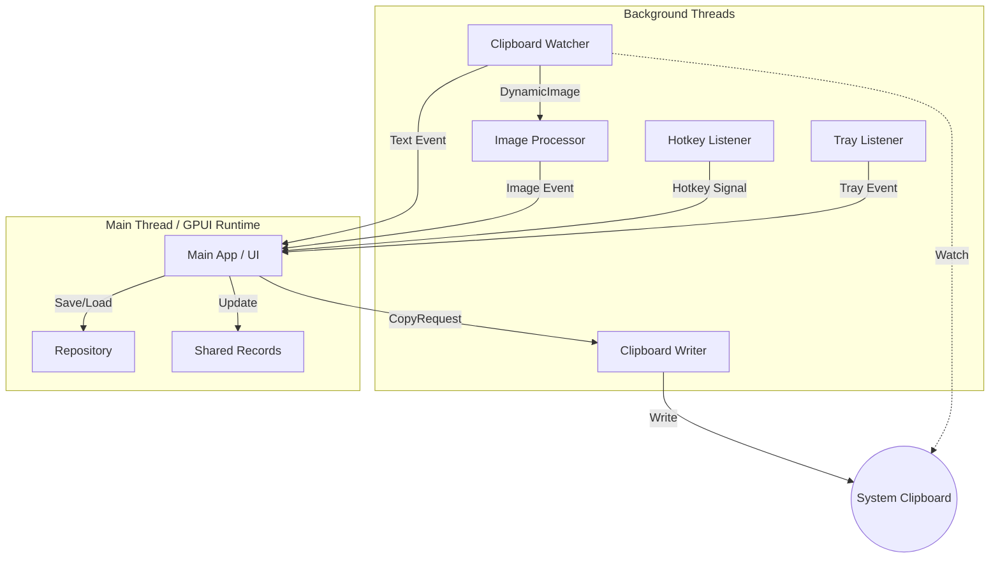
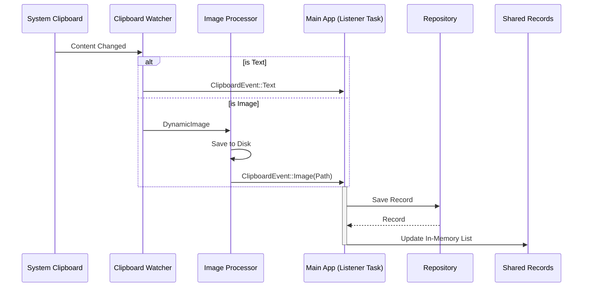

**Concurrency Analysis**

This document details the threading model and message passing architecture of the Ropy application.

# Thread Model

The application uses a multi-threaded architecture to handle various background tasks while keeping the UI responsive.

| Thread                | Responsibility                                                                           | Spawned By                           |
| --------------------- | ---------------------------------------------------------------------------------------- | ------------------------------------ |
| **Main Thread**       | Runs the GPUI event loop, handles UI rendering, and processes events from other threads. | OS / `main`                          |
| **Clipboard Watcher** | Uses `clipboard-rs` to monitor system clipboard changes.                                 | `clipboard::start_clipboard_monitor` |
| **Image Processor**   | Processes images captured from the clipboard (saving to disk, generating thumbnails).    | `clipboard::start_clipboard_monitor` |
| **Clipboard Writer**  | Handles requests to write text or images back to the system clipboard.                   | `clipboard::start_clipboard_writer`  |
| **Hotkey Listener**   | Listens for global hotkeys (e.g., `Ctrl+Shift+D`).                                       | `hotkey::start_hotkey_listener`      |
| **Tray Listener**     | Listens for system tray menu events (Show, Quit).                                        | `tray::init_tray`                    |
| **GPUI Background**   | A thread pool managed by GPUI for running async tasks (e.g., handling channel messages). | GPUI Runtime                         |
| **RSS Monitor**       | (Debug only) Monitors RSS usage.                                                         | `monitor::spawn_rss_monitor`         |

# Message Passing

The application relies heavily on channels (`std::sync::mpsc` and `async_channel`) for communication between threads.

## 1. Clipboard Monitoring Flow

- **Source**: `Clipboard Watcher` thread detects a change.
- **Path 1 (Text)**: Sends `ClipboardEvent::Text` via `clipboard_tx` (async_channel) to the **Main App**.
- **Path 2 (Image)**:
  1. Sends `DynamicImage` via `image_tx` (async_channel) to the `Image Processor` thread.
  2. `Image Processor` saves the image and sends `ClipboardEvent::Image` via `clipboard_tx` to the **Main App**.
- **Handling**: The **Main App** (via a background task spawned on GPUI executor) receives `ClipboardEvent`, updates the `Repository`, and updates the `SharedRecords`.

## 2. Hotkey Flow

- **Source**: `Hotkey Listener` thread detects key press.
- **Path**: Sends `()` via `hotkey_tx` (mpsc) to the **Main App**.
- **Handling**: A background task on the **Main App** receives the signal and dispatches an `Active` action to the window.

## 3. Tray Flow

- **Source**: `Tray Listener` thread detects menu click.
- **Path**: Sends `TrayEvent` via `tray_tx` (mpsc) to the **Main App**.
- **Handling**: A background task on the **Main App** receives the event and either shows the window or quits the app.

## 4. Copy/Paste Flow

- **Source**: User interaction in **Main App** (UI).
- **Path**: Sends `CopyRequest` via `copy_tx` (mpsc) to the `Clipboard Writer` thread.
- **Handling**: `Clipboard Writer` writes the content to the system clipboard.

# Architecture Diagram

# Detailed Data Flow

## Clipboard Event Processing

