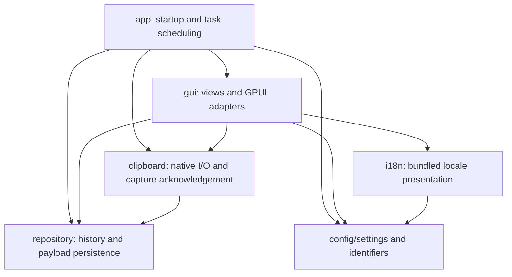

# Architecture

Ropy is a two-package Cargo workspace:

- The root `ropy` package owns the desktop executable, GPUI, native clipboard
  integration, resources, updater and packaging.
- `crates/ropy-core` owns history persistence and portable configuration. It has
  no GPUI, native clipboard, hotkey, tray or GTK dependency.

The root package is the default member, so existing `cargo run`, bundle paths
and application version metadata still refer to the desktop application. Use
`--workspace` for checks of both packages, or `-p ropy-core` for core-only work.

## Dependency direction

Core modules below live under `crates/ropy-core/src`; desktop modules live under
`src`. Dependency arrows crossing the package boundary always point toward core.

The diagram shows application dependencies, not every third-party dependency.
In particular, `repository` may use redb, image encoding, filesystem I/O, and
serialization. Being independent of GPUI does not imply being free of I/O.

| Owner | Responsibility | Boundary |
| --- | --- | --- |
| `repository` | Records, ordering, favorites, indexes, hashes, file-list encoding, payload files and cleanup | No dependency on GPUI, clipboard I/O, configuration, or application utilities |
| `config/settings.rs`, `config/*_id.rs` | TOML format, defaults, validation, recovery protection, theme and locale identifiers | No GUI context, bundled resource discovery, or translated labels |
| `clipboard` | OS clipboard reads/writes, format preference, capture deduplication and persistence acknowledgement | No GPUI context or executor; application schedules its work |
| `gui/repository.rs` | Optional shared repository exposed as a GPUI global | Wraps `Arc<ClipboardRepository>`; storage initialization failure remains representable |
| `gui/settings.rs` | GPUI global for live settings and localized layout labels | `GlobalSettings` wraps the serializable `Settings` value |
| `gui/theme.rs`, `i18n/language.rs` | Discover bundled resources and resolve display names | Consume core identifiers through free functions |
| `app.rs` | Bootstrap, channels, task scheduling and UI notification wiring | Connects native I/O, persistence and GPUI |

`config/autostart.rs` remains a desktop adapter. The settings and identifier
modules live in core; the desktop `config` module re-exports their types alongside
the autostart adapter.
Likewise, `utils` contains application facilities such as logging, lock recovery,
file-manager launching and single-instance enforcement; it is not a core API.

## History and payload ownership

`ClipboardRepository` owns database operations and the associated storage paths.
The existing operation lock continues to cover compound database/index updates
and sidecar cleanup. redb and the in-memory test backend implement the existing
storage seam; no additional repository abstraction is required.

`repository/assets.rs` owns image encoding, thumbnails and HTML/RTF file I/O.
`repository/sidecar.rs` owns record-level removal and superseded-payload cleanup.
Image capture receives the image directory from the initialized repository,
rather than resolving a separate default path in the clipboard layer.

Content hashing and file-list normalization/serialization belong to the
repository's data contract. Both native capture and rendering use the repository
exports, so the repository does not depend on a utility module that imports its
own record types in return.

Keep these persistence contracts stable during structural changes:

- Content tags, hash algorithms, postcard field order and schema version.
- Existing database, image, thumbnail and rich-text paths and names.
- Pinned/favorite ordering and retention exemptions.
- Atomic payload writes, duplicate handling and cleanup after failures.

A module move does not justify a schema migration. A format change needs its own
compatibility design and tests.

## Capture and task lifecycle

`prepare_clipboard_monitor` prepares two work units: an image-encoding future and
a blocking native watcher closure. `app.rs` schedules them with the existing GPUI
background executor. `write_clipboard` consumes the application's request channel
and owns its long-lived native clipboard context. Clipboard modules do not choose
an executor or receive an `App`.

This preserves the existing pipeline and channel policies:

1. Native capture selects a payload and starts a tracked copy attempt.
2. The image queue keeps the newest pending image; ordinary captures use the
   bounded persistence channel.
3. A capture is acknowledged only after repository persistence succeeds.
4. Dropping or evicting an unacknowledged attempt permits retry. Its generation
   prevents an older failure from clearing a newer attempt.
5. Successful persistence sends a coalescible UI refresh notification.
6. Clipboard write completion is reported through the existing completion
   channel before the paste workflow continues.

The application retains the current application-lifetime detached tasks and
watcher behavior. This refactor does not introduce a new shutdown protocol or
change executor/thread placement. A shutdown redesign must account for the
blocking native watcher and in-flight writes separately.

The repository is authoritative for persisted history. The board's shared record
list is a presentation snapshot; selection, filters, scroll position and focus
remain owned by the board. A failed refresh must not become a second history
store.

## Settings and presentation

`Settings` is a plain serializable value. `GlobalSettings` is the GPUI-owned live
snapshot; UI callers read it through a closure and mutate it through the adapter.
The existing settings workflow still restores the previous value if saving fails.
Core validates storage limits and opacity. After loading, the desktop
adapter validates shortcut syntax with `global-hotkey` and restores the default
for invalid values before native registration. The parser and its tests remain
outside core. Recovery defaults still block saving after an invalid configuration load, so a
broken user file is not overwritten by defaults.

`ThemeId` and `Language` own stable serialized codes. Theme aliases are normalized
in the core identifier type. Resource enumeration and display names belong to
`available_themes`, `theme_display_name`, `available_languages` and
`language_display_name` in the presentation modules. Localized layout labels also
belong to the GUI adapter. These are free functions so the desktop package does not need to define
inherent methods on types owned by the core crate.

The settings adapter is a newtype rather than an implementation of GPUI's
`Global` on the external `Settings` type. This keeps the boundary compatible
with Rust's trait coherence rules.

## Public core API

The library exports `config` and `repository`. Internal index, cleanup and
serialization implementation modules remain private. Serializable record and
settings structs use `#[non_exhaustive]`; consumers construct records through
`ClipboardRecord::new` and settings through `Default` or the loading APIs.

The existing generic storage seam is public because capture tests use its
fault-injection backend. `backend::memory` is available only under core's `test`
feature (or core unit tests); the desktop enables it through a dev-dependency.
Normal desktop builds use redb without the in-memory backend. Repositories can
be opened with explicit database/image paths, and settings can be loaded/saved
at explicit paths, so consumers and integration tests need not touch user data.

## Verification

The maintained precheck formats, lints, tests and documents the entire workspace.
`scripts/check/check_core_dependencies.py` checks normal, build and dev dependency
edges across all features and target platforms, rejecting desktop dependencies.
CI also runs `cargo test --locked -p ropy-core --all-targets --all-features` in a
separate Linux job without installing desktop system libraries. The aggregate CI
gate requires that job as well as the existing desktop checks.

`scripts/tests/test_architecture.py` retains a source-level check for module
layering and clipboard scheduling, while the separate Cargo package prevents
core from importing desktop application modules. Public API integration tests
exercise real database reopen, rich-text persistence and settings recovery as an
external consumer. Existing behavior tests moved with their owners. See
[Testing](TESTING.md) for commands and coverage expectations.

## Build and release ownership

Both members inherit the same workspace lint policy and shared dependency
versions. The private core library has its own internal version and disables
cargo-release and cargo-dist participation. The version script explicitly selects
`ropy`, as does macOS bundling. Root metadata, `build.rs`, assets and updater
`CARGO_PKG_VERSION` therefore keep their application meaning.

`cargo test -p ropy-core` builds only core and its test dependency graph. Full
workspace tests still build GPUI. Independent compilation is verified, but no
end-to-end build-time or runtime performance improvement is claimed without a
controlled before/after measurement.

## Separate runtime follow-ups

- Move history cleanup and list queries off the GPUI foreground path. Return a
  coherent snapshot with a request revision so stale results cannot overwrite
  newer filters, settings or history changes.
- Give long-lived native services explicit stop/completion ownership if restart
  or shutdown requirements need it.

The workspace extraction preserves the current runtime scheduling and persisted
formats; these runtime changes require their own behavioral validation.
