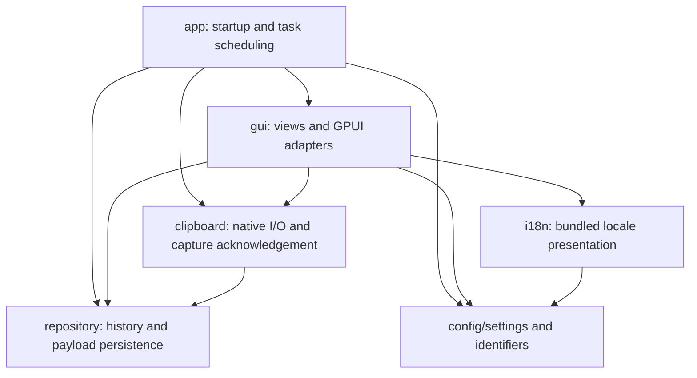

# Architecture

Ropy is a single Cargo package with one desktop executable. The module boundaries
below prepare a possible `ropy-core` library without introducing a workspace
before there is a need for independent compilation or another consumer.

## Dependency direction

The diagram shows application dependencies, not every third-party dependency.
In particular, `repository` may use redb, image encoding, filesystem I/O, and
serialization. Being independent of GPUI does not imply being free of I/O.

| Owner | Responsibility | Boundary |
| --- | --- | --- |
| `repository` | Records, ordering, favorites, indexes, hashes, file-list encoding, payload files and cleanup | No dependency on GPUI, clipboard I/O, configuration, or application utilities |
| `config/settings.rs`, `config/*_id.rs` | TOML format, defaults, validation, recovery protection, theme and locale identifiers | No GUI context, bundled resource discovery, or translated labels |
| `clipboard` | OS clipboard reads/writes, format preference, capture deduplication and persistence acknowledgement | No GPUI context or executor; application schedules its work |
| `gui/repository.rs` | Optional shared repository exposed as a GPUI global | Wraps `Arc<ClipboardRepository>`; storage initialization failure remains representable |
| `gui/settings.rs` | GPUI global for live settings and localized layout labels | `GlobalSettings` wraps the serializable `Settings` value |
| `gui/theme.rs`, `i18n/language.rs` | Discover bundled resources and resolve display names | Consume core identifiers through free functions |
| `app.rs` | Bootstrap, channels, task scheduling and UI notification wiring | Connects native I/O, persistence and GPUI |

`config/autostart.rs` remains a desktop adapter. The extractable settings boundary
is the settings and identifier modules, not the entire `config` directory.
Likewise, `utils` contains application facilities such as logging, lock recovery,
file-manager launching and single-instance enforcement; it is not a core API.

## History and payload ownership

`ClipboardRepository` owns database operations and the associated storage paths.
The existing operation lock continues to cover compound database/index updates
and sidecar cleanup. redb and the in-memory test backend implement the existing
storage seam; no additional repository abstraction is required.

`repository/assets.rs` owns image encoding, thumbnails and HTML/RTF file I/O.
`repository/sidecar.rs` owns record-level removal and superseded-payload cleanup.
Image capture receives the image directory from the initialized repository,
rather than resolving a separate default path in the clipboard layer.

Content hashing and file-list normalization/serialization belong to the
repository's data contract. Both native capture and rendering use the repository
exports, so the repository does not depend on a utility module that imports its
own record types in return.

Keep these persistence contracts stable during structural changes:

- Content tags, hash algorithms, postcard field order and schema version.
- Existing database, image, thumbnail and rich-text paths and names.
- Pinned/favorite ordering and retention exemptions.
- Atomic payload writes, duplicate handling and cleanup after failures.

A module move does not justify a schema migration. A format change needs its own
compatibility design and tests.

## Capture and task lifecycle

`prepare_clipboard_monitor` prepares two work units: an image-encoding future and
a blocking native watcher closure. `app.rs` schedules them with the existing GPUI
background executor. `write_clipboard` consumes the application's request channel
and owns its long-lived native clipboard context. Clipboard modules do not choose
an executor or receive an `App`.

This preserves the existing pipeline and channel policies:

1. Native capture selects a payload and starts a tracked copy attempt.
2. The image queue keeps the newest pending image; ordinary captures use the
   bounded persistence channel.
3. A capture is acknowledged only after repository persistence succeeds.
4. Dropping or evicting an unacknowledged attempt permits retry. Its generation
   prevents an older failure from clearing a newer attempt.
5. Successful persistence sends a coalescible UI refresh notification.
6. Clipboard write completion is reported through the existing completion
   channel before the paste workflow continues.

The application retains the current application-lifetime detached tasks and
watcher behavior. This refactor does not introduce a new shutdown protocol or
change executor/thread placement. A shutdown redesign must account for the
blocking native watcher and in-flight writes separately.

The repository is authoritative for persisted history. The board's shared record
list is a presentation snapshot; selection, filters, scroll position and focus
remain owned by the board. A failed refresh must not become a second history
store.

## Settings and presentation

`Settings` is a plain serializable value. `GlobalSettings` is the GPUI-owned live
snapshot; UI callers read it through a closure and mutate it through the adapter.
The existing settings workflow still restores the previous value if saving fails.
Recovery defaults still block saving after an invalid configuration load, so a
broken user file is not overwritten by defaults.

`ThemeId` and `Language` own stable serialized codes. Theme aliases are normalized
in the core identifier type. Resource enumeration and display names belong to
`available_themes`, `theme_display_name`, `available_languages` and
`language_display_name` in the presentation modules. Localized layout labels also
belong to the GUI adapter. These are free functions so a future external core
crate does not require application-defined inherent methods on its types.

The settings adapter is a newtype rather than an implementation of GPUI's
`Global` on a future external `Settings` type. This keeps that future boundary
compatible with Rust's trait coherence rules.

## Verification

`scripts/tests/test_architecture.py`, included in the normal precheck, rejects
forbidden imports and qualified dependency paths in the core modules and GPUI
references in clipboard modules. It is a source-level regression guard, not a
Rust dependency resolver; a future crate boundary will provide the stronger
compiler-enforced guarantee.

Behavior remains covered at its existing owner: repository/backend tests,
payload atomic-write and repair tests, capture retry/eviction tests, settings
serialization and recovery tests, and GPUI interaction tests. Tests moved with
the code they exercise. See [Testing](TESTING.md) for the complete gate and test
conventions.

## Future workspace and runtime work

A minimal workspace would keep the desktop package at the root and extract one
`ropy-core` library containing the repository and settings/identifier modules.
The desktop package would retain GPUI, native clipboard adapters, autostart,
translations, themes, updater orchestration and packaging assets. Expose only
needed operations and value types; keep backend implementation details private.
Do not turn each module or helper into a crate.

Before extraction, decide the core API's visibility, move any presentation-only
aliases out of its models, and supply explicit application paths where needed.
Then verify that `cargo test -p ropy-core` has no GPUI or native clipboard
transitive dependency. Update checks to cover all workspace members and validate
release scripts, resource paths and version metadata. The updater currently uses
`CARGO_PKG_VERSION`; moving it to another package would change which version it
reads.

Two runtime changes are deliberately separate follow-ups:

- Move history cleanup and list queries off the GPUI foreground path. Return a
  coherent snapshot with a request revision so stale results cannot overwrite
  newer filters, settings or history changes.
- Give long-lived native services explicit stop/completion ownership if restart
  or shutdown requirements need it.

Measure core-only test time and full application build time before claiming a
workspace improves either. The current single-package gate still builds GPUI.
